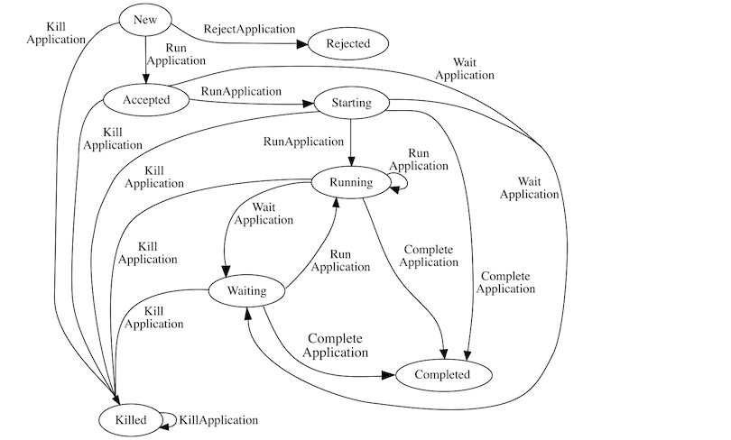
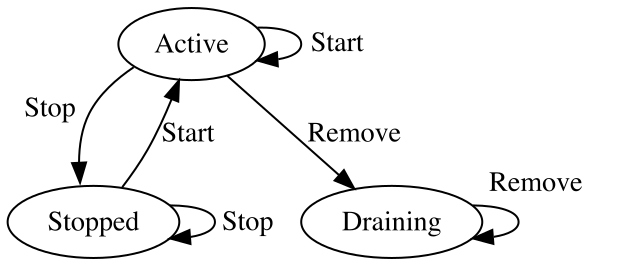

<!--
 * Licensed to the Apache Software Foundation (ASF) under one
 * or more contributor license agreements.  See the NOTICE file
 * distributed with this work for additional information
 * regarding copyright ownership.  The ASF licenses this file
 * to you under the Apache License, Version 2.0 (the
 * "License"); you may not use this file except in compliance
 * with the License.  You may obtain a copy of the License at
 *
 *     http://www.apache.org/licenses/LICENSE-2.0
 *
 * Unless required by applicable law or agreed to in writing, software
 * distributed under the License is distributed on an "AS IS" BASIS,
 * WITHOUT WARRANTIES OR CONDITIONS OF ANY KIND, either express or implied.
 * See the License for the specific language governing permissions and
 * limitations under the License.
 -->

The YuniKorn project uses state machines to track the states of different objects.
This ranges from applications in the core to nodes in the k8shim.
The state machines are independent and not shared between the resource managers and core.
A resource manager shim, and the core can thus have an independent idea of the state of a similar object.

## Core Scheduler
State change are triggered by events that get processed.
One event can cause a change for multiple states or no change at all.

### Application State 
Applications have a complex state model.
An application when created starts ain the new state.

An application can have the following states:
* New: A new application that is being submitted or created, from here the application transitions into the accepted state when it is ready for scheduling.
The first ask to be added will trigger the transition.
* Accepted: The application is ready and part of the scheduling cycle.
On allocation of the first ask the application moves into a starting state.
This state is part of the normal scheduling cycle.
* Starting: The application has exactly one allocation confirmed this corresponds to one running container/pod. 
The application transitions to running if and when more allocations are added to the application.
This state times out automatically to prevent applications that consist of just one allocation from getting stuck in this state.
The current time out is set to 5 minutes, and cannot be changed.
If after the timeout expires the application will auto transition to running.
The state change on time out is independent of the number of allocations added. 
This state is part of the normal scheduling cycle.
* Running: The state in which the application will spend most of its time.
Containers/pods can be added to and removed from the application. 
This state is part of the normal scheduling cycle.
* Waiting: An application that has no pending requests or running containers/pod will be waiting.
This state shows that the application has not been marked completed yet but currently is not actively being scheduled.
* Completed: The resource manager has signalled that the application is done. 
This is a final state. The application cannot change state after entering.
* Killed: Removed by the resource manager at the request of an administrator or the user running the application.
This is a final state. The application cannot change state after entering.
* Rejected: The application was rejected when it was added to the scheduler. 
This only happens when a resource manager tries to add a new application, when it gets created in a New state, and the scheduler rejects the creation.
Applications can be rejected due ACLs denying access to a queue the application has specified, or a placement via placement rules has failed. 
This is a final state. The application cannot change state after entering.

The events that can trigger a state change:
* Reject: rejecting the application by the scheduler (source: core scheduler)
* Run: progress an application to the next active state (source: core scheduler)
* Wait: mark an application as idle (source: core scheduler)
* Complete: mark an application as complete (source: resource manager)
* Kill: kill an application (source: resource manager)

Here is a diagram that shows the states with the event that causes the state to change:  

### Object State
<!-- fix the draining to stopped transition -->
The object state is used by the following objects:
* queues
* partitions

The object states are as follows: 
* Active: The object is active and used during the scheduling cycle.
This is the starting and normal state of an object.
An active object transitions to draining when it is removed.  
* Stopped: The object is stopped and no longer actively scheduled.
The object if empty is ready to be removed from the scheduler.
The object can transition back into active state if it gets re-started.
* Draining: Before an object can be removed it needs to be cleaned up.
The cleanup starts with placing the object in the draining state.
In this state it does not accept additions or changes but is still actively being scheduled.
This allows for a graceful shutdown, cleanup and removal of the object.
This is the final state.

The events that can trigger a state change:
* Start: make the object active (source: core scheduler)
* Stop: make the object inactive (source: core scheduler)
* Remove: mark an object for removal (source: core scheduler)

Here is a diagram that shows the states with the event that causes the state to change:  

### Node
<!-- should start using object state -->
Node objects in the core are not using a state machine but do have a state.
A node can have one of two states: `schedulable` or `not schedulable`.
There is no complex state model or complex transition logic.
The scheduler can either use the node or not.

The node status changes based on the status provided by the resource manager (shim) that owns the node. 

## K8Shim Resource Manager

### Application
To be added

### Task
To be added

### Node
To be added

### Scheduler
To be added