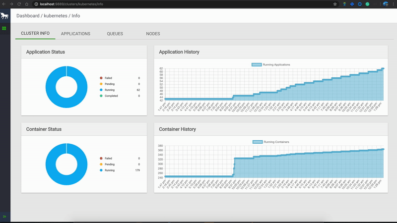

<!--
Licensed to the Apache Software Foundation (ASF) under one
or more contributor license agreements.  See the NOTICE file
distributed with this work for additional information
regarding copyright ownership.  The ASF licenses this file
to you under the Apache License, Version 2.0 (the
"License"); you may not use this file except in compliance
with the License.  You may obtain a copy of the License at

  http://www.apache.org/licenses/LICENSE-2.0

Unless required by applicable law or agreed to in writing,
software distributed under the License is distributed on an
"AS IS" BASIS, WITHOUT WARRANTIES OR CONDITIONS OF ANY
KIND, either express or implied.  See the License for the
specific language governing permissions and limitations
under the License.
-->

在阅读本指南之前，我们假设您有一个Kubernetes集群或本地Kubernetes开发环境，例如MiniKube。
还假定 `kubectl` 在您的环境路径内，并且配置正确。
遵循此 [指南](../developer_guide/env_setup.md) 来讲述如何使用 docker-desktop 设置本地Kubernetes群集。

## 安装

最简单的方法是使用我们的Helm Charts在现有的Kubernetes集群上部署YuniKorn。
我们建议使用Helm 3或更高版本。

```shell script
helm repo add yunikorn  https://apache.github.io/incubator-yunikorn-release
helm repo update
kubectl create namespace yunikorn
helm install yunikorn yunikorn/yunikorn --namespace yunikorn
```

默认情况下，helm chart将在集群中安装调度器、web服务器和 admission-controller。
安装 `admission-controller` 后，它只需将所有流量路由到YuniKorn即可。
这意味着资源调度会委托给YuniKorn。在helm安装过程中，可以通过将 `embedAdmissionController` 标志设置为false来禁用它。

如果你不想使用helm的charts，您可以找到我们的细节教程 [点击这里](../developer_guide/deployment.md) 。

## 卸载

运行如下的命令卸载YuniKorn:
```shell script
helm uninstall yunikorn --namespace yunikorn
```

## 访问 Web UI

部署调度器时，web UI也部署在容器中。
标准端口上web界面的端口转发可以通过以下方式打开：

```
kubectl port-forward svc/yunikorn-service 9889:9889 -n yunikorn
kubectl port-forward svc/yunikorn-service 9080:9080 -n yunikorn
```

`9889` 是 Web UI 的默认端口, `9080` 是调度器 Restful 服务的默认端口，web UI 会从中检索信息。
完成此操作后，web UI将在以下地址可用: http://localhost:9889.



YuniKorn UI提供了集群资源容量、利用率和所有应用信息的集中视图。

